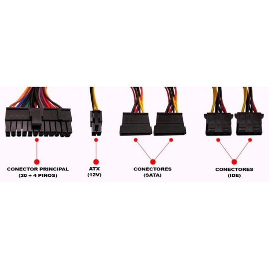

Fonte tem a função de transformar a energia, de tensão alternada para contínua. Todas as fontes de desktops são padronizadas no formato ATX. Muda a potência e a quantidade de pinos ATX para alimentar o processador (4, 6 ou 8). 
Já fontes de laptop geralmente tem conexões de saída proprietárias, que as torna incompatíveis entre si. Em geral, não consigo usar uma fonte da Acer em um notebook Asus, e vice versa. Atenção, pois as vezes os conectores são iguais, mas a tensão (Voltagem) e corrente (Amperagem) são diferentes.
> Dica: Se a fonte do seu notebook deixar de funcionar, mande arrumar. As fontes originais são muito superiores que as genéricas. Evite tanto quanto possível usar fontes não originais em notebooks e celulares. 

#### Principais características:
- Potência (em Watts) - define a capacidade máxima de energia que a fonte consegue entregar quanto estiver em 100% de uso. Evite usar a capacidade máxima da fonte, pois a maior eficiência costuma estar entre 40% e 60% do máximo. O cálculo de Watts é:
         Watts = Voltagem x Amperagem 
         Exemplo: ``5 Volts x 2,4 Amperes = 12 Watts (carregador de celular)``
- Fator de potência (eficiência) - define o quanto de perda a fonte tem ao transformar a energia. Para fontes ATX, existe os selos "80 Plus", ou seja, mais de 80% de eficiência. Fator de potência também é usado em nobreaks para cálculo dos sistemas. Assista ao vídeo 'fonte de potência real'.
- Conectores: Nas fontes ATX para desktop, os conectores são padronizados, conforme figura anexa. Existem os conectores ATX 24 pinos; ATX 4, 6 ou 8 pinos para o processador; molex para fan; SATA para HD e SSD; e por fim, conector de 6 a 8 pinos para placa de vídeo. 

> Info notebook: conforme dito anteriormente, fontes de laptop usam conectores escolhidos pelo seu fabricante. Desta forma, um notebook Dell não permite o uso de fontes da Acer; uma fonte HP provavelmente não conecta em um laptop Asus. As vezes, o conector é o mesmo, não existe uma regra. Para cada marca e modelo, existe a potência de saída da fonte. E cada marca usa uma tensão (voltagem) diferente. Ou seja, tome tento ao usar a fonte não original.

#### Links úteis

[Fontes de potência real - Mitos Ep. 08
](https://www.clubedohardware.com.br/artigos/energia/fontes-de-pot%C3%AAncia-real-mitos-ep-08-r36682/)

[Tudo sobre fontes de alimentação
](https://www.clubedohardware.com.br/artigos/energia/tudo-sobre-fontes-de-alimenta%C3%A7%C3%A3o-r34441/)

[Calculadora de Fonte de Alimentação
](https://br.msi.com/power-supply-calculator)